<!-- $size: a4 -->

Mi diseñador se enfermó, se acerca el deadline y tengo que escribir HTML, ¡Ayuda!
===

###### Por Aldo Fregoso ( [@aldo_mx](https://twitter.com/Aldo_MX) )

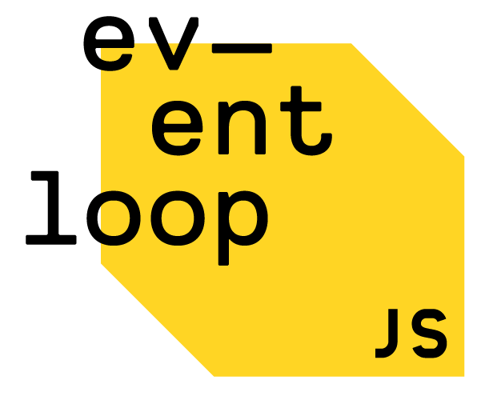

---

# Introducción

## ¿Qué tiene de malo HTML?

---

# Introducción

## Herramientas de Templating

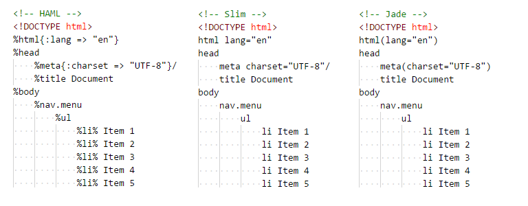

---

# Introducción

## Plugin para IDEs y Editores

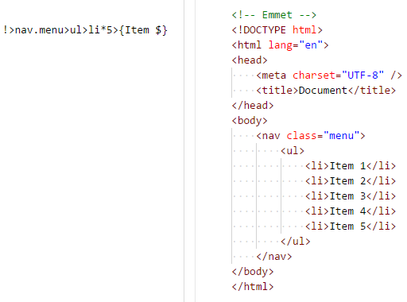

---

# Introducción a Emmet

## Instalación

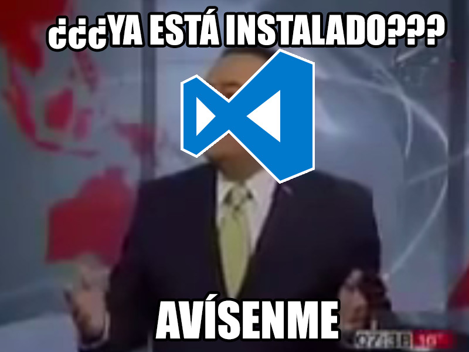

---

# Introducción a Emmet

## Otros editores

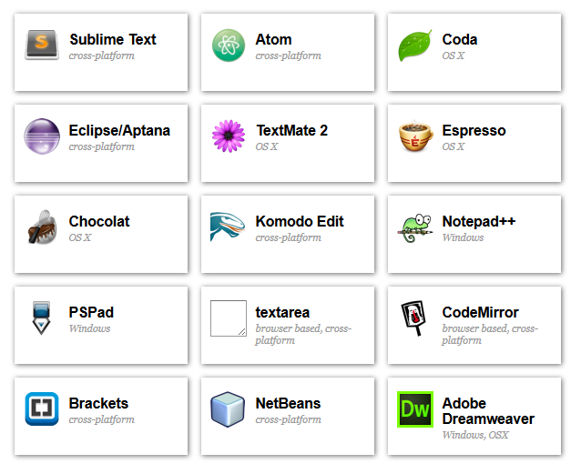

---

# Introducción a Emmet

## ¿Trabajas con CSS? Ya conoces el 80% de Emmet

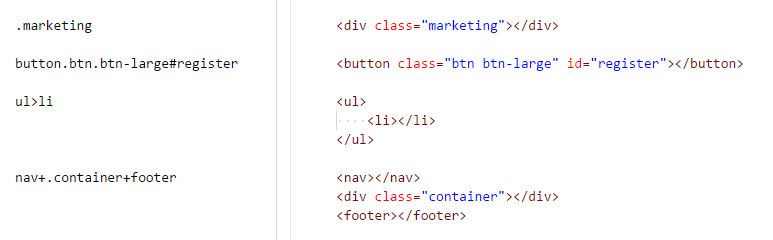

---

# Introducción a Emmet

## Operadores Adicionales

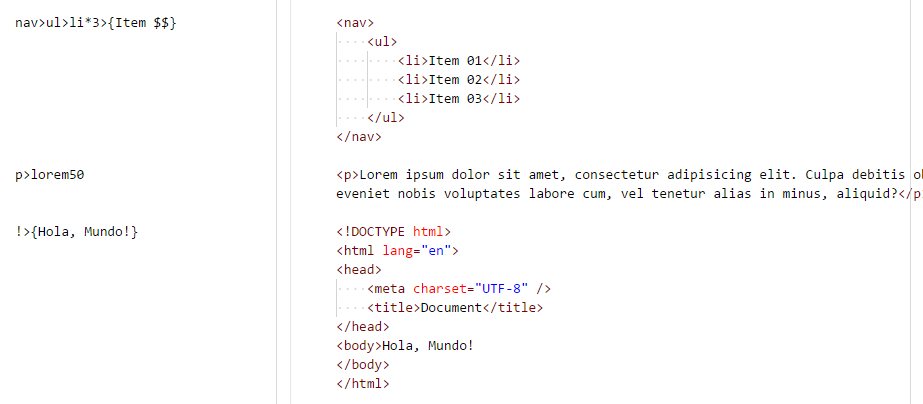

---

# Introducción a Emmet

## Emmet dentro de CSS

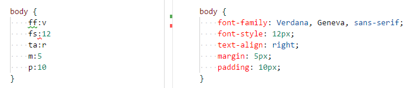

---

# Introducción a Emmet

## Detrás de cámaras (snippets.json)

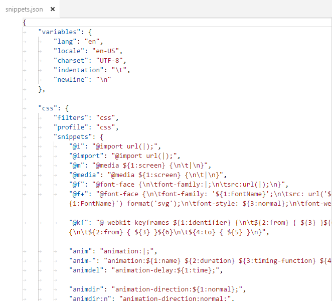

---

# Editando archivos existentes

## Acciones

Letras chiquitas: Cada editor require configuración previa

---

# Editando archivos existentes

## Acciones (HTML)

### Eliminar tags (Ctrl + K)

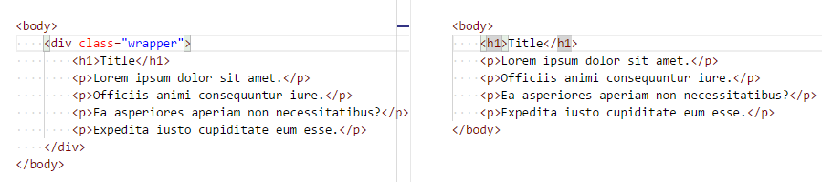

### Rodear con tags (Ctrl + Shift + A)

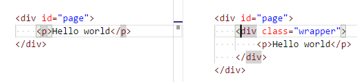

---

# Editando archivos existentes

## Acciones (CSS)

### Evaluar Operaciones Matemáticas (Ctrl + Shift + Y)

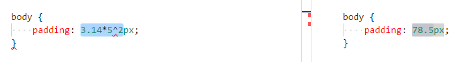

### Reflejar Valor (Ctrl + B)

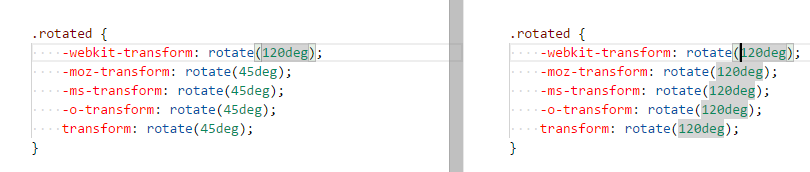

---

# Ok, está muy padre, pero...

## Tengo una SPA en Angular

- Setear `"emmet.syntaxProfiles": "angular"`

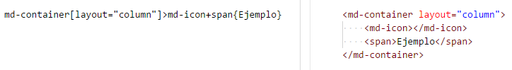

---

# Ok, está muy padre, pero...

## Ya uso un motor de templating

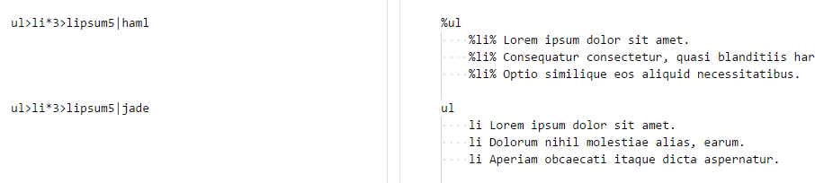

---

# Conclusión

---

# Links de interés

- Sitio oficial
  http://emmet.io/
- Documentación oficial
  http://docs.emmet.io/
- Chat de Event Loop
  http://chat.javascriptmx.com/
- Marp (Diapositivas en Markdown)
  https://yhatt.github.io/marp/

---

# Preguntas y Respuestas

Descarga ésta presentación y el material de apoyo de:
https://github.com/AldoMX/emmet-introduction/

